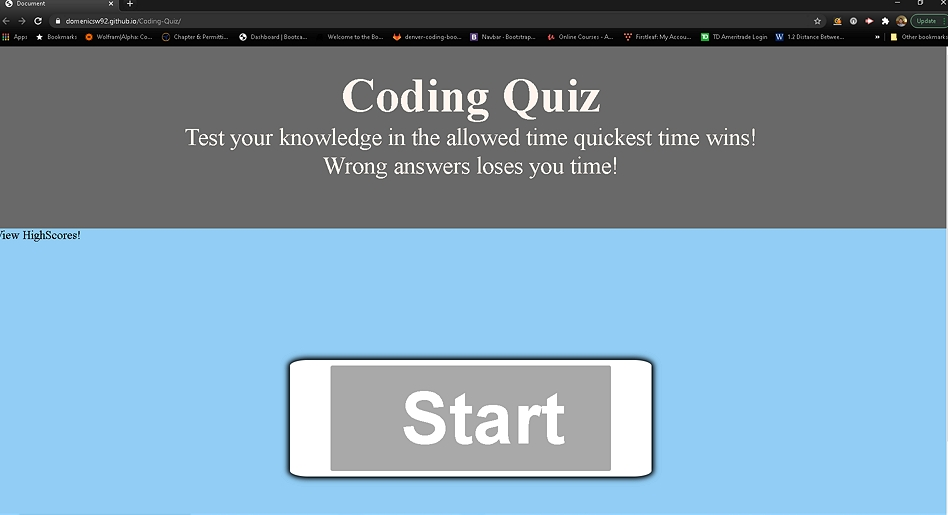
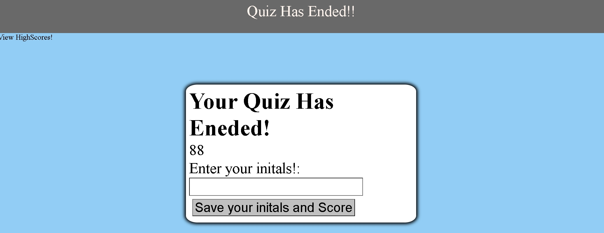
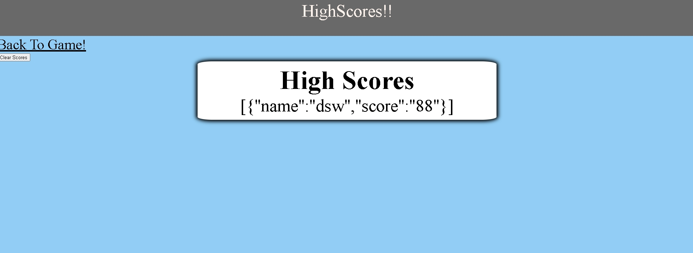

# Coding-Quiz
Please visit the deployed site  https://domenicsw92.github.io/Coding-Quiz/

# Description 
The purpose of this assignment was to create a timer-based coding assessment using vanilla JavaScript that behaves like so:

The site has a few multiple choice question and a countdown timer time is subtracted for wrong answers and added for correct answers.
The site is also connected to a HighScore page that will display saved scores on the local device.

The site deploys with the option to either start the quiz or view the past highscores of the local device 

After finishing the quiz your score will be displayed and you can submit your score and initials
   

After submitting your score and initials you will be giving the option to restart the quiz or view scores 

Clicking on the view highscore will deploy you to the Highscore page
On the highscore page you have an option to go back to the game or clear all the scores

